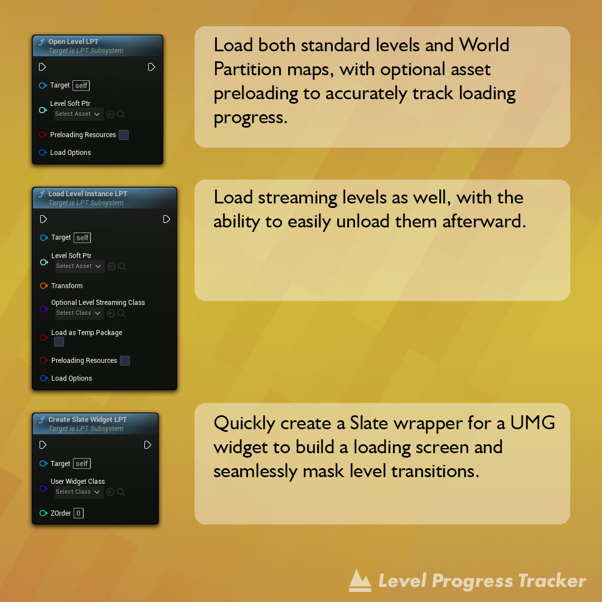
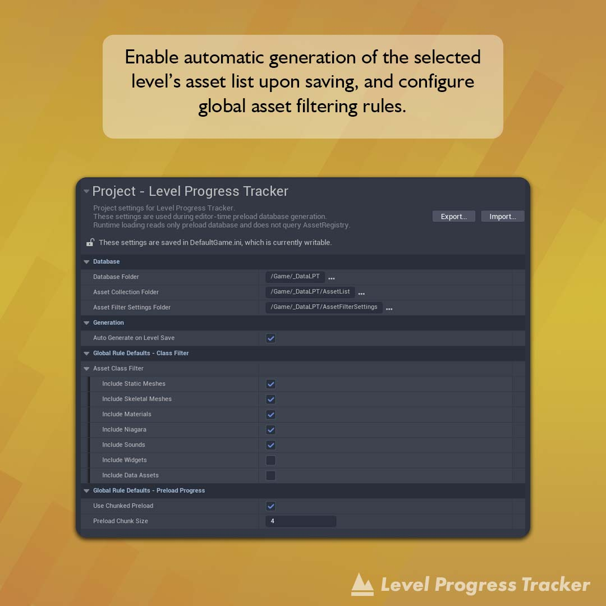
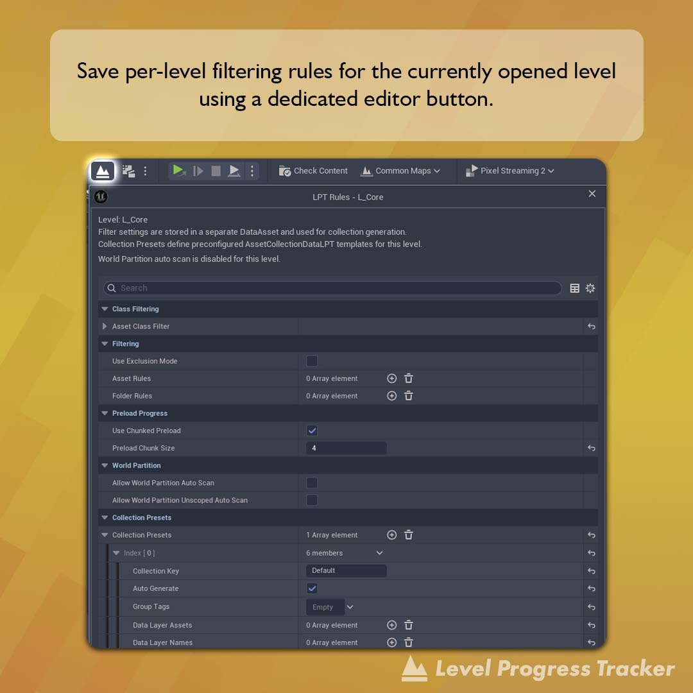
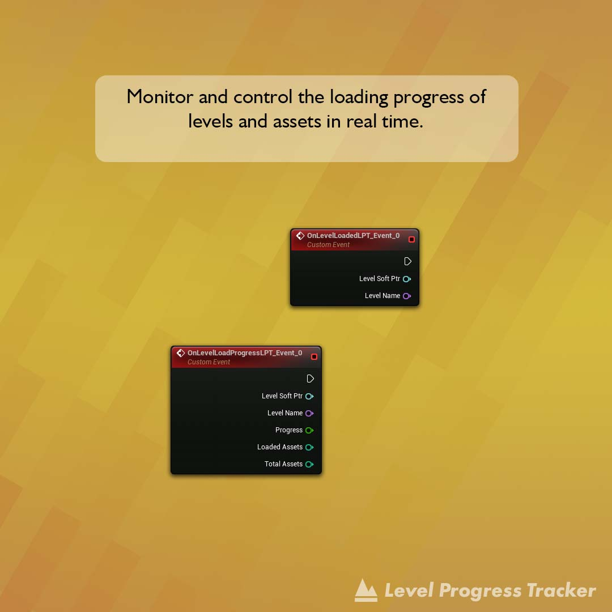

# Level Progress Tracker
LPT is a plugin for Unreal Engine 5 that allows you to quickly and easily create a loading screen with a progress bar for level transitions.

 

> [!NOTE]
> The plugin has been pre-packaged only for Win64 and Android.

## Latest Updates
`Experimental`

`Version 1.3.6`
- Complete global code refactoring and optimization
- Added widget filtering option
- Fixed and significantly improved asset filtering logic during the level database list creation stage
- Introduced the ability to manually set per-level asset preloading step size, allowing you to balance precision and performance individually for each level

## What it's for
- Tracking the progress of level asset loading.

## Features
- Ultra-fast setup and creation of a loading screen for level transitions.
- Automatic level type recognition: World Partition, Streaming Level, or regular.
- Tracks the loading progress of both regular and streaming levels.
- Automatically scans specified levels for assets and monitors their loading progress in real time.
- Extremely flexible loading progress bar configuration.
You can choose one of three approaches:
  - fully automatic asset detection for the level.
  - completely manual list of assets to load.
  - or hybrid mode (automatic + manual overrides).

- Optional resource loading. It can be disabled, but in that case, progress tracking for resource loading will not work. However, delegates for full level loading will still function.
- Tracks level asset loading packages and their count.
- Built-in functions for loading screens — simply add your UMG widget, and it will function as a Slate widget. This means that your specified UMG widget will not be forcibly closed during a level transition.
- Powerful global asset filtering system located in Project Settings > Level Progress Tracker.
You can add individual assets, entire folders, Data Layers or Cells either as exclusions (blacklist) or as allowed items only (whitelist / inverse mode).
- Convenient branded plugin button that lets you quickly configure filtering rules specifically for the current level right from the editor.

## Install

> [!NOTE]
> Starting with Unreal Engine version 5.6, it is recommended to use the new project type based on C++. After copying the plugin folder, be sure to perform a full project rebuild in your C++ IDE.

1. Make sure the Unreal Engine editor is closed.
2. Move the "Plugins" folder to the root folder of your created project.
3. Run your project to which the "Plugins" folder with 'LevelProgressTracker' was added. If a message about restoring the module appears, select "Yes".
4. Done! The 'Level Progress Tracker' folders should appear in the Unreal Engine browser and the plugin should be automatically activated. If the plugin folder is not visible, activate visibility through the browser settings: `Settings > Show Plugin Content`.

## How to use it?
An interactive step-by-step tutorial on how to use LPT can be found in the file: `B_LPT_GameMode_Demo`, which is located at the path `Plugins\Level Progress Tracker Content\DemoFiles\`.

## (C++) Documentaion
All sources contain self-documenting code.
