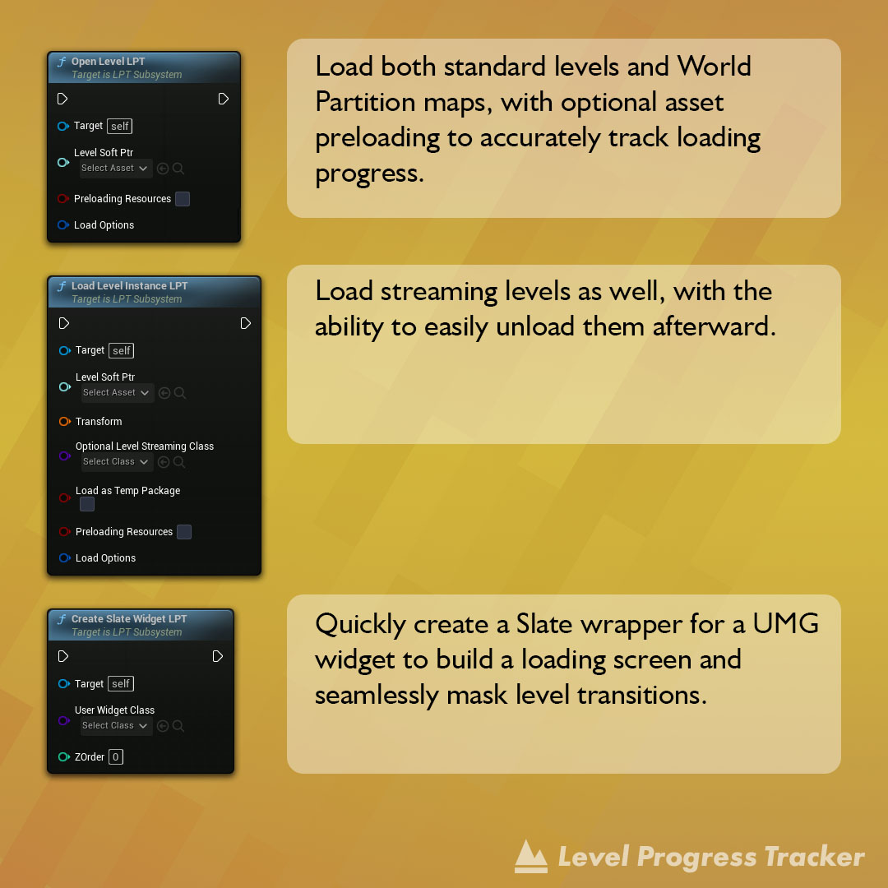
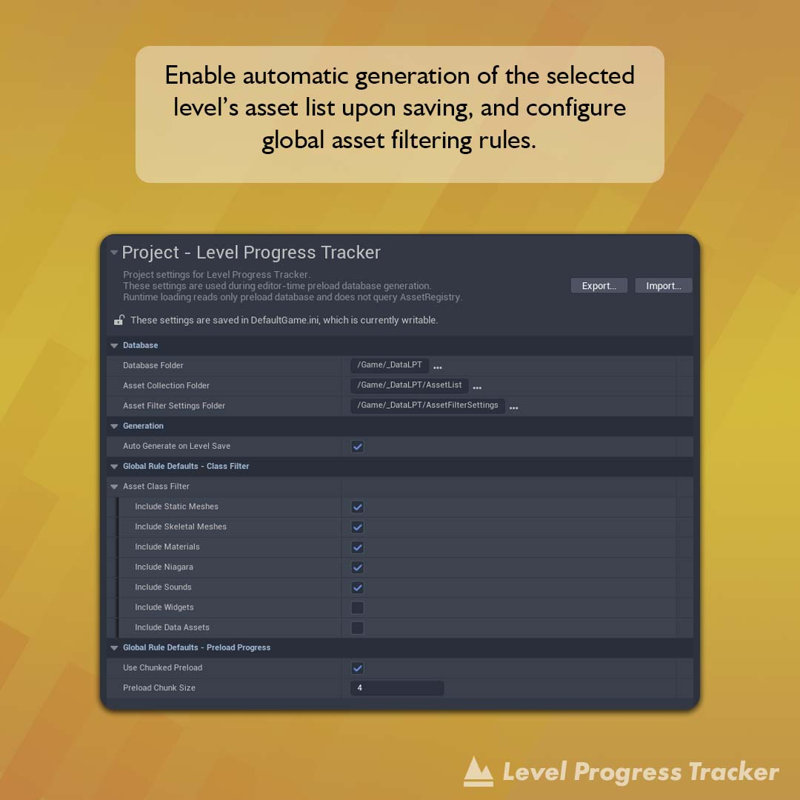
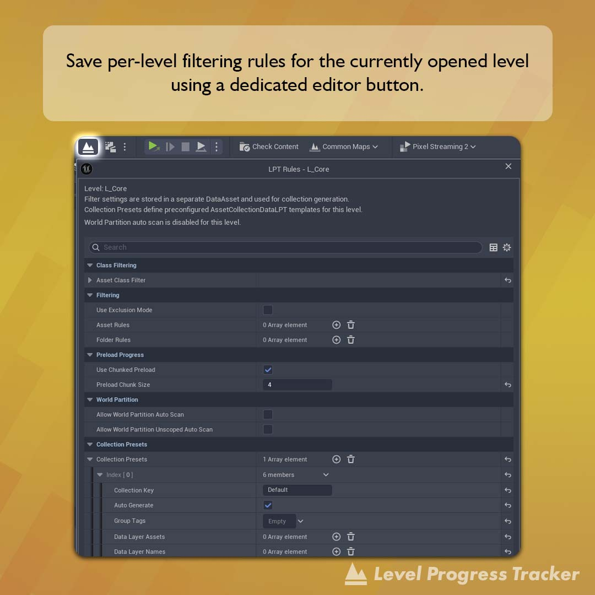
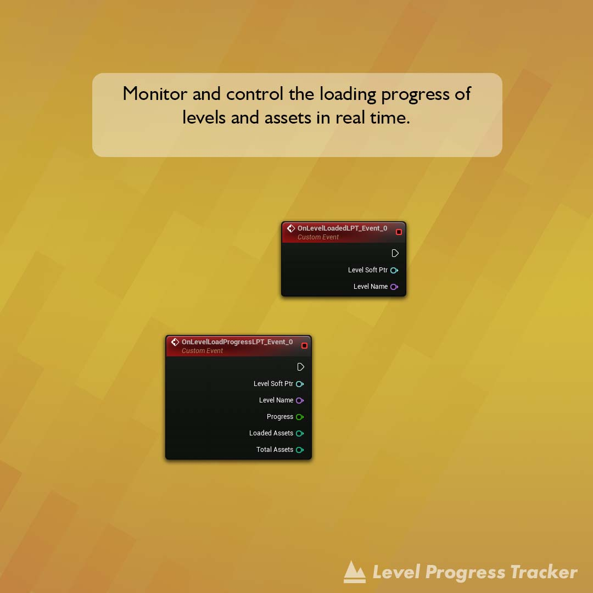

# Level Progress Tracker
LPT is a plugin for Unreal Engine 5 that allows you to quickly and easily create a loading screen with a progress bar for level transitions.

 

> [!NOTE]
> The plugin has been pre-packaged only for Win64 and Android.

## Latest Updates
`Experimental`

`Version 1.4.2`
- Built for Unreal Engine 5.7.4.
- Added functions: `LoadLevelInstanceWithLPT(AActor* LevelInstanceActor, ...)` and `UnloadLevelInstanceWithLPT(AActor* LevelInstanceActor)`
	- FLevelStreamingDelegates Subscription: LPT subscribes to public `FLevelStreamingDelegates`.
	- Immediate Instance Detection: `ULevelStreamingLevelInstance` is detected immediately upon calling `UWorld::AddStreamingLevel()`.
	- Automatic Preload Trigger: Preloading from the LPT database is triggered as soon as a Level Instance is detected.
	- Progress Tracking: Loading progress is broadcast via the existing `OnLevelLoadProgressLPT` and `OnLevelLoadedLPT` delegates.
	- Instance Key Isolation: External instances use a unique key per streaming object, preventing conflicts between multiple Level Instances referencing the same World Asset.
	- API Details:
		- Does not require replacing `ALevelInstance`.
		- Utilizes the standard `ILevelInstanceInterface`.
		- Performs LPT preload first, then calls standard `LoadLevelInstance()`.
		- Does not create a duplicate streaming level.
		- Handles cases gracefully if the Level Instance is already loaded or detected by the automatic observer.
		- Cancels preload if an unload is pending.
	-	Usage Example:
		- `LPTSubsystem->LoadLevelInstanceWithLPT(LevelInstanceActor, true);`
		- Note for Blueprint: The function is exposed in the LPT Subsystem category.
- Bug Fixes & Improvements:
	- Crash on Exit: Fixed a crash occurring after exiting the application when using a World Partition level in Lyra Starter Game projects.
	- Empty External Actor Bug: Fixed an issue where an empty external actor was added when `Allow World Partition Auto Scan` and `Allow World Partition Unscoped Auto Scan` options were enabled on World Partition levels.
	- Asset Generation during Cook: Resolved asset generation issues during project packaging using a three-layer protection approach:
		- Persistent Cook protection.
		- Hash-based early exit with generator versioning.
		- Re-entrancy protection when saving LPT assets themselves.
- What Was Fixed / Updated:
	- Cook Cmdlet Ignore: `OnPackageSaved` now consistently ignores the Cook cmdlet.
	- Re-entrancy Guard: Added protection against recursive calls when saving LPT assets.
	- Hash-based Early Exit: `LevelStateHash` is now utilized as a true early exit condition.
	- Generation Hash Versioning: Added a generation hash version to ensure existing databases rebuild once after algorithm updates.
	- Redundant Rebuilds Avoided: Repeated saves of an unchanged World Partition level no longer trigger a full rebuild.
	- Conditional Asset Saves: Collection assets are now saved only when actual changes occur.
	- State Tracking: Database structure changes, creation of new records, and preset materialization are now tracked independently.
	- Logging Improvements: Replaced the `Rebuilding` log entry with `Checking LPT state`, as rebuilds now only occur when the state actually changes.

## What it's for
- Tracking the progress of level asset loading.

## Features
- Ultra-fast setup and creation of a loading screen for level transitions.
- Automatic level type recognition: World Partition, Streaming Level, or regular.
- Tracks the loading progress of both regular and streaming levels.
- Extremely flexible loading progress bar configuration.
You can choose one of three approaches:
  - fully automatic asset detection for the level.
  - completely manual list of assets to load.
  - or hybrid mode (automatic + manual overrides).

- Optional resource loading. It can be disabled, but in that case, progress tracking for resource loading will not work. However, delegates for full level loading will still function.
- Tracks level asset loading packages and their count.
- Built-in functions for loading screens — simply add your UMG widget, and it will function as a Slate widget. This means that your specified UMG widget will not be forcibly closed during a level transition.
- Powerful global asset filtering system. You can add individual assets, entire folders, Data Layers or Cells either as exclusions (blacklist) or as allowed items only (whitelist / inverse mode).
- Convenient plugin button that lets you quickly configure filtering rules specifically for the current level right from the editor.
- Preload asset list collections that can be loaded by tag (highly useful when working with World Partition levels).
- The "Preload Chunk Size" option allows you to specify the amount of assets loaded per single operation. Lower values offer higher precision but result in slower loading times.

## Install

> [!NOTE]
> Starting with Unreal Engine version 5.6, it is recommended to use the new project type based on C++. After copying the plugin folder, be sure to perform a full project rebuild in your C++ IDE.

1. Make sure the Unreal Engine editor is closed.
2. Move the "Plugins" folder to the root folder of your created project.
3. Rebuild the project in your C++ IDE.
4. Done! The 'Level Progress Tracker' folders should appear in the Unreal Engine browser and the plugin should be automatically activated. If the plugin folder is not visible, activate visibility through the browser settings: `Settings > Show Plugin Content`.

## How to use it?
An interactive step-by-step tutorial on how to use LPT can be found in the file: `B_LPT_GameMode_Demo`, which is located at the path `Plugins\Level Progress Tracker Content\DemoFiles\`.

## (C++) Documentaion
All sources contain self-documenting code.
