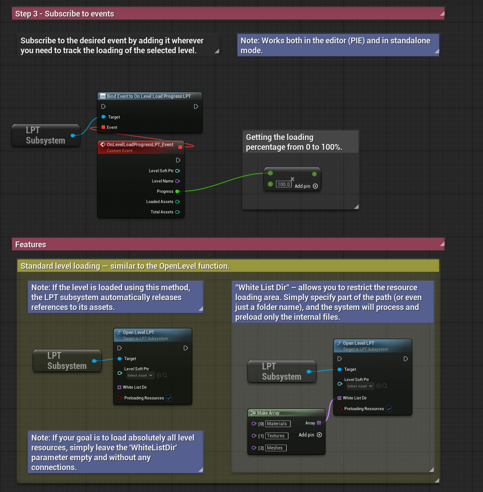
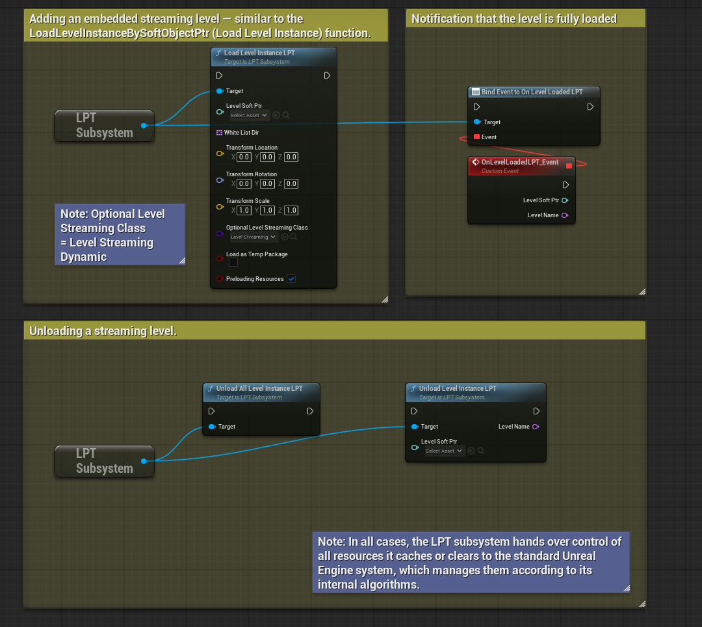
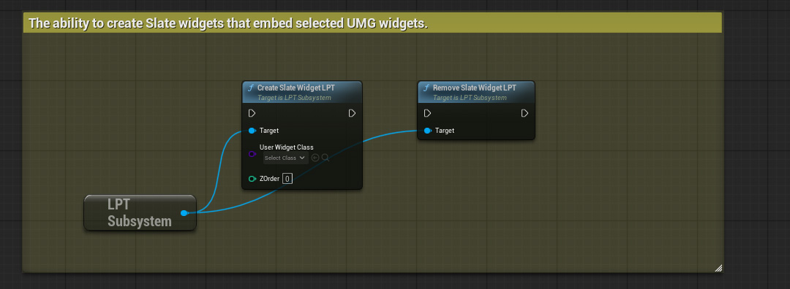

# Level Progress Tracker
LPT is a plugin for Unreal Engine 5 that allows you to quickly and easily create a loading screen with a progress bar for level transitions.

 

> [!NOTE]
> The plugin has been pre-packaged only for Win64 and Android.

## Latest Updates
`Experimental` `Beta`

`Version 1.2.0` 
- Global update.
- Build version for Unreal Engine 5.6.0
- Code refactoring and decomposition.
- Improved code security and fixed critical errors in extreme situations (e.g., when loading and managing many embedded levels, as well as during critical subsystem shutdown).
- Added the ability to enable and disable resource preloading for both level-loading methods.
- New functions added: `CreateLoadingScreenLPT` and `RemoveLoadingScreenLPT`. These are special Blueprint-supported functions that allow creating a loading screen based on <b>Slate</b> and <b>UMG</b>. The target UMG is loaded via `FStreamableManager` and added as a child directly into Slate, which enables the widget to remain visible even when the level is opened using OpenLevel. (Note: it is recommended to manage the Slate widget through the Game Instance.)

## What it's for
- Tracking the progress of level asset loading.

## Features
- Ultra-fast setup and creation of a loading screen for level transitions.
- Automatic level type recognition: World Partition, Streaming Level, or regular.
- Tracks the loading progress of both regular and streaming levels.
- Automatically scans specified levels for assets and monitors their loading progress in real time.
- Optional resource loading. It can be disabled, but in that case, progress tracking for resource loading will not work. However, delegates for full level loading will still function.
- Tracks level asset loading packages and their count.
- The "White List Dir" parameter in the level loading function is designed to selectively load only specific assets. This can be useful when working with a World Partition level containing a large number of placed assets. Moreover, you don’t need to specify the full path to the assets—just a keyword that may be present in a soft reference pointing to an asset collection is enough. If you want to include all level assets, simply leave this parameter unconnected (or empty, if using C++).
- Built-in functions for loading screens — simply add your UMG widget, and it will function as a Slate widget. This means that your specified UMG widget will not be forcibly closed during a level transition.

## Install

> [!NOTE]
> Starting with Unreal Engine version 5.6, it is recommended to use the new project type based on C++. Otherwise, when creating a new Blueprint project, you may encounter the following error: "Engine modules are out of date, and cannot be compiled while the engine is running. Please build through your IDE." This issue does not occur in a pure C++ project.

1. Make sure the Unreal Engine editor is closed.
2. Move the "Plugins" folder to the root folder of your created project.
3. Run your project to which the "Plugins" folder with 'LevelProgressTracker' was added. If a message about restoring the module appears, select "Yes".
4. Done! The 'Level Progress Tracker' folders should appear in the Unreal Engine browser and the plugin should be automatically activated. If the plugin folder is not visible, activate visibility through the browser settings: `Settings > Show Plugin Content`.

## How to use it?
An interactive step-by-step tutorial on how to use LPT can be found in the file: `B_LPT_GameMode_Demo`, which is located at the path `Plugins\Level Progress Tracker Content\DemoFiles\`.

## (C++) Documentaion
All sources contain self-documenting code.
